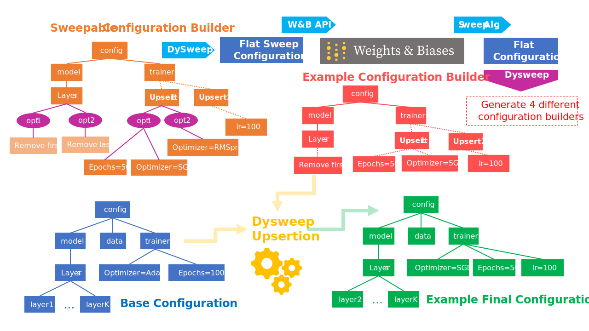

<div align="center">

<h1>
<big><b><i>Dysweep</i></b></big><br/>
</h1>
<h4>
<i>Enhanced Weights and Biases Sweeps for Systematic Experimentation!</i>
</h4>


[](https://pypi.org/project/dysweep/)
[](https://zenodo.org/badge/latestdoi/643277847)
[](https://join.slack.com/t/dysweep/shared_invite/zt-1ynkfdpdc-wiYHkiLzjrZ8yGqYkM9brQ)



Use the extended capabilities of *Dysweep* library on top of Weights & Biases for fast and comprehensive experimentation in your research projects.
</div>

## Table of Contents

- [Features](#features)
- [Applications](#applications)
- [Installation](#installation)
- [Usage](#usage)
- [Visualizing the Sweep](#visualizing-the-sweep)
- [Tutorial and Use-Cases](#tutorial-and-use-cases)
- [An Image Classification Example](./tutorials/image_classification.ipynb)
- [License](#license)


Dysweep is an innovative Python library designed to extend and enhance the functionalities of the [Weights and Biases (WandB) sweep library](https://docs.wandb.ai/guides/sweeps). Dysweep is built with the belief that an entire experiment should be executable through a configuration dictionary, whether it's formatted as a YAML or JSON file. Moreover, using generic hierarchical configurations, managing a wide variety of research tasks is feasible. With the re-running and resuming capabilities, this package works well in tandem with any cloud computing service or cluster that allows large-scale parallel computing.

## Features

Dysweep introduces two major enhancements:

### Checkpointing for the Sweep Server

Dysweep introduces checkpointing for the sweep server, which becomes extremely beneficial when dealing with preemptions or specific bugs that can interrupt the sweep process. This feature ensures that even if a sweep is running on a machine that may preempt the tasks or if certain configurations encounter specific bugs, the sweep process can resume from a checkpoint directory. Unlike the original WandB sweep, where a lost configuration is ignored by the WandB agent function, Dysweep overlays an API on top of this agent function, thereby enabling certain runs to resume. This is especially useful when only a small fraction of runs fail, thus eliminating the need to re-run the entire sweep.

### Running Sweeps Over Hierarchies

Perhaps the most significant capability of Dysweep is its ability to run sweeps over hierarchically structured parameters. The original WandB sweep configuration is limited to flat parameter sets. However, deep learning experiments often demand more complex, nested sets of configurations. Dysweep enables this, effectively eliminating the need for hard-coding the selection between different classes with primitive methods. Instead, you can define a new YAML that automatically selects between class types and initialization arguments, streamlining the setup process and making it more robust.

Dysweep is inspired by [DyPy](https://github.com/vahidzee/dypy), a library used for deep learning experimentation, and mirrors its vision of facilitating fully generic configuration YAML files that encapsulate code snippets. Hence, Dysweep offers a versatile configuration set that empowers you to define experiments at any layer of abstraction.

## Applications

Dysweep is envisioned to particularly facilitate the following applications:

1. **Large Scale Hyper Parameter Tuning**: Dysweep is geared towards conducting large scale hyper parameter tuning not just within the confines of a specific model, but across various models and methods. This functionality paves the way for a more comprehensive and detailed study of the effects of hyperparameters.

2. **Running Models Over Different Configurations and Datasets**: Once a model is ready, Dysweep enables it to run over a multitude of configurations and datasets. It provides a systematic way to define a sweep in WandB, allowing every experiment to run in parallel across different machines. This significantly eases the process of large-scale computing and data gathering for a particular model.

## Installation

You can install the Dysweep library through [PyPi](https://pypi.org/project/dysweep/) using the following command:

```shell
pip install dysweep
```

## Usage
Once the Dysweep library is successfully installed, it comes with two scripts:

- One script to initialize a sweep based on a defined base configuration
- Another script to run agents, as well as to resume or re-run specified configurations
  
A sweep configuration can be defined via a `config.yaml` file. This configuration file can then be utilized in the command-line to run the desired function as follows:
```bash
dysweep_create -c config.yaml
```
The `config.yaml` file is a standard [ResumanbleSweepConfig](./dysweep/parallel.py) configuration file. It includes the following key fields:
1. `base_config`: Defines the base configuration for creating the sweep.
2. `sweep_configuration`: Specifies the hierarchical configuration used to update (upsert) the base configuration.
3. `project`: Identifies the project name under which the sweep is created.
4. `entity`: Designates the Weights & Biases (WandB) entity employed in the sweep creation.

You can also find additional parameters from `ResumanbleSweepConfig` that may be of interest from the [source code](./dysweep/parallel.py).

For instance, you can run the following command:
```bash
dysweep_create --config config.yaml --project <my_project> --entity <my_entity>
```
Once you've executed the function, it will output a sweep identifier. This identifier can be used across multiple machines to run various sweep configurations.

In addition, you can utilize the `dysweep_run_resume` script to execute the agent. This script allows you to define the sweep identifier and the number of run counts with a specific function from a package to run. If you need to resume a run, specify the run identifier and set `resume` to `True`. Detailed guidance is available in our [Tutorial](./tutorials/image_classification.ipynb).

If for example, you have a function `main` in a file denoted by `path.to.my.package`,  Here's an example of running the agent:

```bash
dysweep_run_resume --package <path.to.my.package> --function <main> --sweep_id <sweep_id> --count <run_count>
```

And here are examples for resuming a single run or multiple runs:

```bash
dysweep_run_resume --package <path.to.my.package> --function <main> --sweep_id <sweep_id> --rerun_id <run_id> --resume True
```

```bash
dysweep_run_resume --package <path.to.my.package> --function <main> --sweep_id <sweep_id> --count <run_count> --resume True
```

## Visualizing the Sweep

Using the `sweep_alias` and `sweep_identifier` values, each of the subtrees of the directory you are sweeping upon will be visualized as the `sweep_identifier` value you've set for it to be. This is especially useful when you have a particular knob in your configuration that you want to sweep over, but it is burried deep within the hierarchical configuration. 

As for values, we know that with dysweep the values we sweep upon are no longer just a primitive type, but rather a dictionary. In order to visualize the values, we have to specify a `sweep_alias` for each of the values we want to visualize. This `sweep_alias` will be a key that sits instead of those values for better visualization.

In addition to that, each of the runs will contain a `dy_config` in their `wandb.config` that you can check from the weights and biases UI. Using these configurations, you can filter runs, group them, or compare them. For example, if we have a configuration hierarchy where the dataset type is in `dataset.type`, we can filter runs by dataset type by using the following query:

```
dy_config.dataset.type = "cifar10"
```
## Tutorial and Use-Cases

We selected a standard task in deep learning - image classification - and utilized various convolutional models and datasets to demonstrate the broad capabilities of Dysweep. We subjected this problem to multiple configurations through our pipeline. For a hands-on understanding of the process, you can refer to our detailed Jupyter notebook available [here](./tutorials/image_classification.ipynb).

Make sure to install all the requirements before running the tutorial section:

```bash
# The requirements of the main package itself
pip install -r requirements.txt
# The requirements for running the examples
pip install -r requirements-testing.txt
```

## License

Dysweep is released under [MIT License](./LICENSE).


